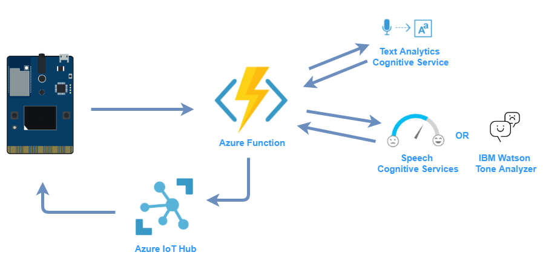
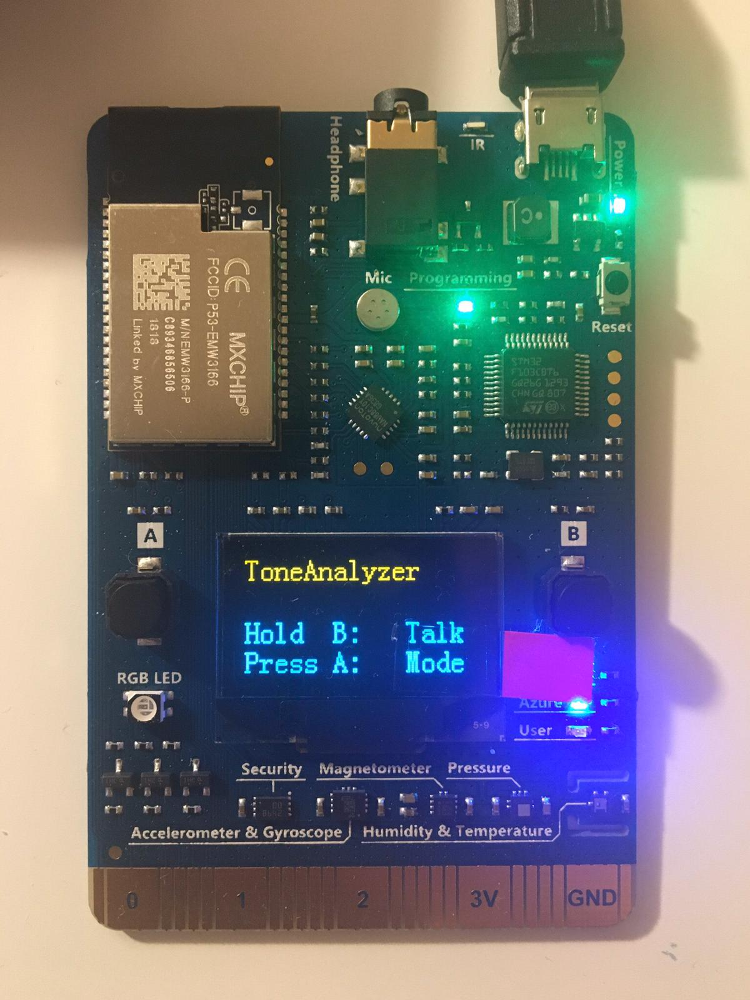
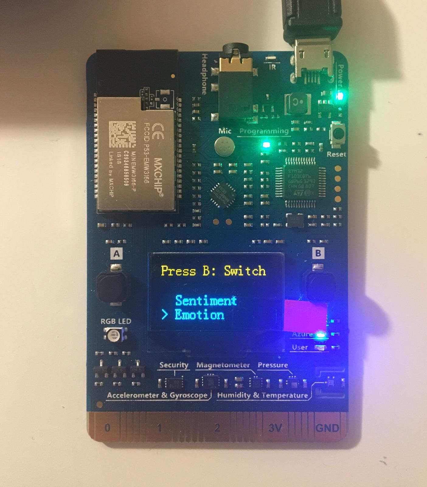
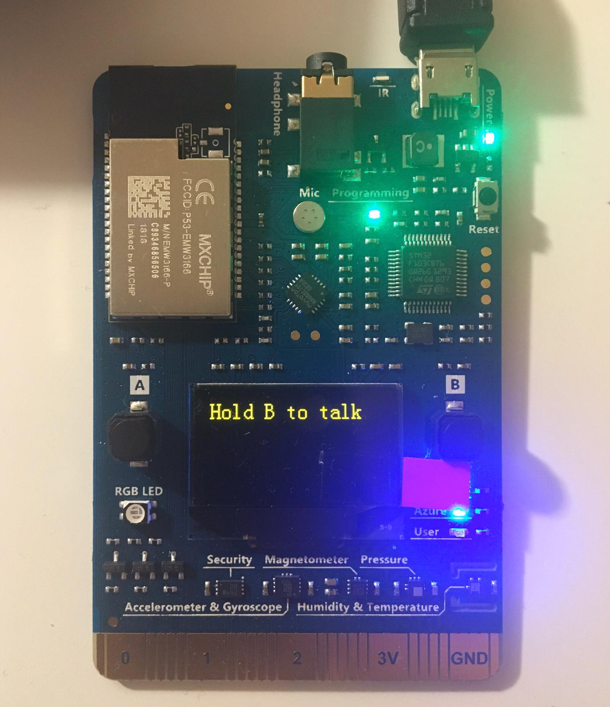
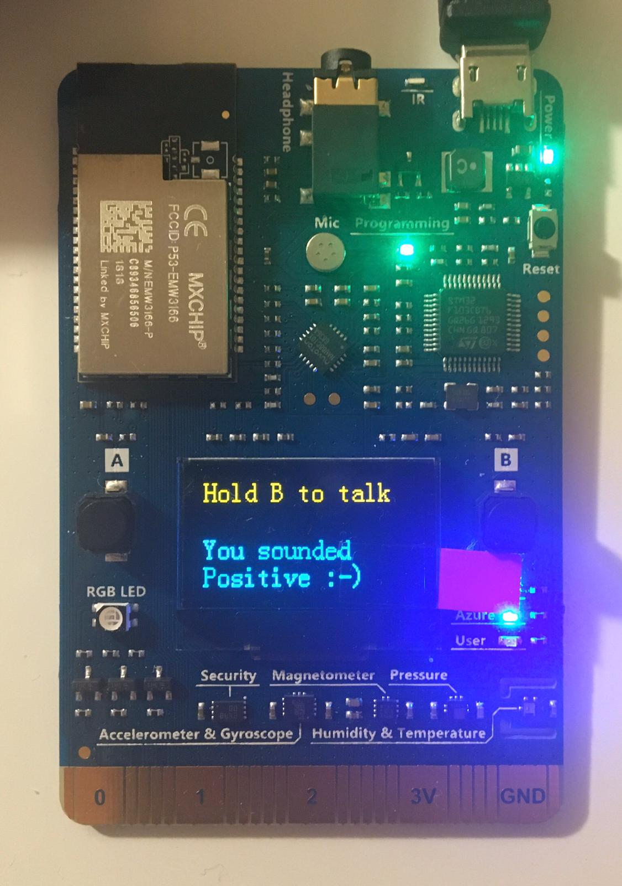

# MXChip IoT DevKit Tone Analyzer 
A tone analyzer application built for the Microsoft Devkit AZ316. The app analyses the sentences you record to then come up with an accurate analysis of the tone of your words.

## How it works

The IoT DevKit records your voice then posts an HTTP request to trigger an Azure Function. The Azure Function calls the speech-to-text Cognitive Service API to do a transcript of your recording. The function then sends the transcript to an text analysis service of your choice (either the Microsoft's Text Analytics Cognitive service or the IBM's Watson Tone Analyzer). After Azure Functions gets the analysis from the chosen service, it then sends a C2D message to the device through the IoT Hub. Finally the analysis is displayed on the screen.

## Requirements
* MXChip IoT DevKit
* Visual Studio Code
* [Arduino](https://www.arduino.cc/) installed on your machine (note: Windows make sure you use the installer for Windows XP and up!)
* Microsoft Azure account
* IBM Cloud account

## How to set it up
* [Configure the MXChip board](https://github.com/jimbobbennett/MXChip-Workshop/blob/master/Steps/ConfigureTheBoard.md) 
* [Configure Visual Studio Code](https://github.com/jimbobbennett/MXChip-Workshop/blob/master/Steps/ConfigureVSCode.md)
* [Connect IoT DevKit AZ3166 to Azure IoT Hub](https://docs.microsoft.com/en-us/azure/iot-hub/iot-hub-arduino-iot-devkit-az3166-get-started)
* Set up the Speech and Text Analytics Cognitive Services
* Set up the [IBM Watson Tone Analyzer](https://www.ibm.com/watson/services/tone-analyzer/)
* You will need to create a Function App on your Azure and publish the ToneAnalyserFunction of this repo
* Copy personal connection strings and API keys from the services to the Azure Function application main class
* Copy Function endpoint to AZURE_FUNCTION_URL in the DevKit code
* Upload the device code contained in the ToneAnalyserDevice folder to the DevKit and you are ready to go

## How to use
#### 1. Press A to change the mode

#### 2. Select mode ("Sentiment" for Text Analytics Cognitive Service and "Emotion" for Watson Tone Analyzer)

#### 3. Record your voice

#### 4. Wait for the result

## Special thanks
[Jim Bennet](https://github.com/jimbobbennett) for hosting the [MXChip Workshop](https://github.com/jimbobbennett/MXChip-Workshop) at the University of Plymouth where he introducing me to the IoT DevKit and Azure for the first time.

## References
* [Microsoft Text Analytics](https://docs.microsoft.com/en-gb/azure/cognitive-services/text-analytics/)
* [Microsoft Speech Service](https://docs.microsoft.com/nb-no/azure/cognitive-services/speech-service/)
* [IBM Watson Tone Analyzer](https://cloud.ibm.com/apidocs/tone-analyzer#introduction)
* Code inspiration: [IoT DevKit Translator](https://github.com/Azure-Samples/mxchip-iot-devkit-translator/blob/master/Device/DevKitTranslator.ino)
